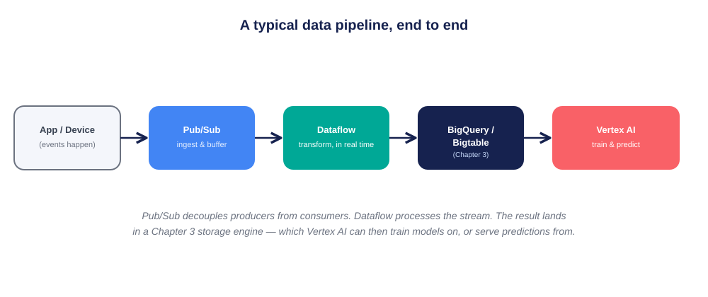
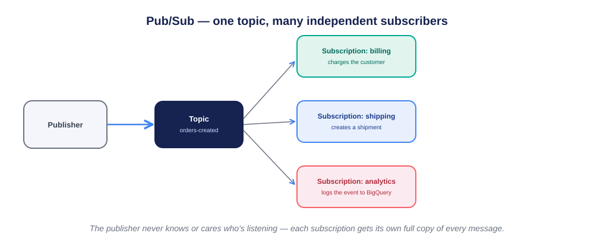
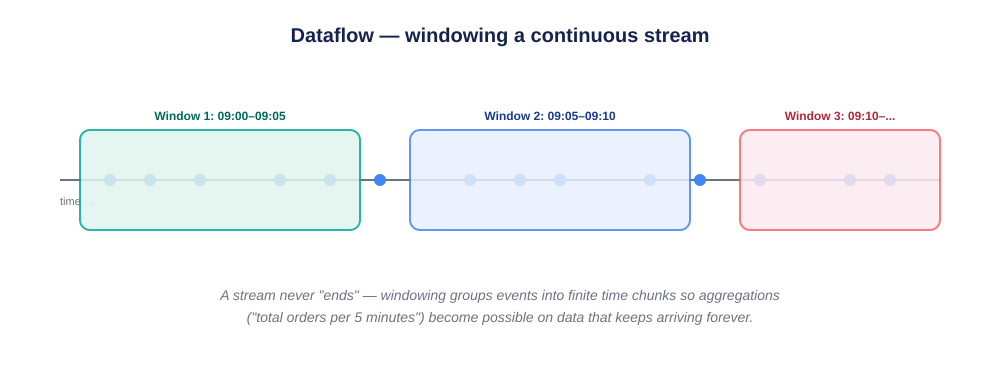
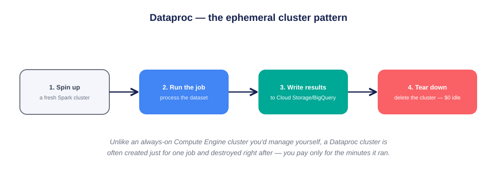
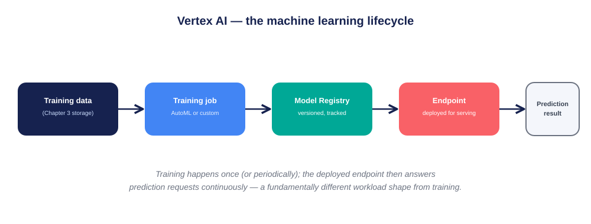
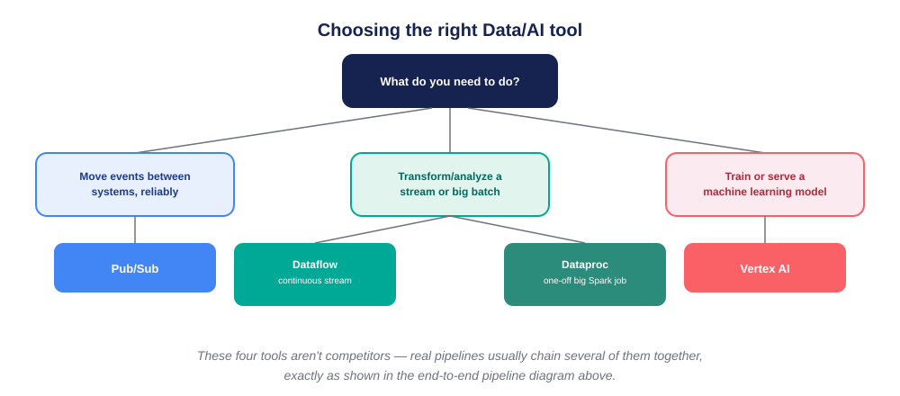

# 🤖 Chapter 5: Data & AI — GCP Deep Dive

> *"Data doesn't do anything by itself. These four services are how it moves, gets shaped, and eventually becomes a prediction."*

[]()
[](https://cloud.google.com/products/ai)
[]()
[]()
[]()

```
CH.1 IAM  →  CH.2 Compute  →  CH.3 Storage & DB  →  CH.4 Networking  →  CH.5 Data & AI (you)
```

**This is Chapter 5 of a self-directed GCP learning series.** Every diagram below is built to be understood by someone who has never touched GCP before — no prior networking or data-engineering background assumed. Chapters 1–4 gave you identity, compute, storage, and networking. This chapter is about what happens *between* those things: how data actually moves, gets transformed, and eventually powers a machine learning prediction.

> **Note on this repo:** this chapter is documented in full theoretical depth, diagram-first. The hands-on project comes next.

---

## 📖 Table of Contents
1. [Why This Chapter Exists](#-why-this-chapter-exists)
2. [The Four Tools, at a Glance](#-the-four-tools-at-a-glance)
3. [🖼️ Diagram Index](#️-diagram-index)
4. [Pub/Sub, Explained Simply](#-pubsub-explained-simply)
5. [Dataflow, Explained Simply](#-dataflow-explained-simply)
6. [Dataproc, Explained Simply](#-dataproc-explained-simply)
7. [Vertex AI, Explained Simply](#-vertex-ai-explained-simply)
8. [Dataflow vs. Dataproc — The Question Everyone Asks](#-dataflow-vs-dataproc--the-question-everyone-asks)
9. [How IAM Applies Here](#-how-iam-applies-here)
10. [Core Principles](#-core-principles)
11. [FAQ](#-faq)
12. [Glossary — Zero Jargon Left Unexplained](#-glossary--zero-jargon-left-unexplained)
13. [Self-Check Questions](#-self-check-questions)
14. [What's Next](#-whats-next)

---

## 🎯 Why This Chapter Exists

Imagine a single event: a customer places an order on a website.

That one event might need to: charge the customer, update inventory, notify a warehouse, and get logged for tomorrow's sales report — all **without the website itself knowing or caring about any of that**. That separation — "the thing that happened" vs. "everyone who needs to react to it" — is the entire reason this chapter's tools exist.

> **Analogy — a newspaper.** A newspaper publisher doesn't personally deliver the paper to every subscriber's door, and doesn't need to know who those subscribers are. They just publish. Anyone who wants a copy subscribes. If a new person subscribes tomorrow, the publisher's job doesn't change at all. This is exactly how **Pub/Sub** works, and it's the seed that the rest of this chapter grows from.

---

## 🧰 The Four Tools, at a Glance

| Tool | In one sentence | Analogy |
|---|---|---|
| **Pub/Sub** | Moves individual events between systems, reliably | A newspaper subscription service |
| **Dataflow** | Continuously transforms a stream (or processes a batch) of data | A conveyor belt with workers doing a task on each item as it passes |
| **Dataproc** | Runs big, one-off data processing jobs using Spark/Hadoop | Renting a fully-staffed factory for one day, then giving it back |
| **Vertex AI** | Trains and serves machine learning models | A student who studies (training), then answers exam questions (predictions) |

---

## 🖼️ Diagram Index

| # | File | What it shows |
|---|---|---|
| 1 | `diagrams/01-pipeline-overview.svg` | The full journey: an event → Pub/Sub → Dataflow → storage → Vertex AI |
| 2 | `diagrams/02-pubsub-fanout.svg` | One Pub/Sub topic feeding three completely independent subscribers |
| 3 | `diagrams/03-dataflow-windowing.svg` | How Dataflow slices a never-ending stream into workable time chunks |
| 4 | `diagrams/04-dataproc-lifecycle.svg` | The four-step ephemeral cluster pattern: spin up → run → save → destroy |
| 5 | `diagrams/05-vertex-ai-lifecycle.svg` | The full ML journey: data → training → model registry → endpoint → prediction |
| 6 | `diagrams/06-decision-tree.svg` | A simple flowchart for picking the right tool for your task |



---

## 📬 Pub/Sub, Explained Simply

**The problem it solves:** if your website directly called the billing system, the shipping system, and the analytics system every time an order happened, those systems would all be tightly tangled together — if one is slow or down, the website itself could break.

**How it works:** a **publisher** sends a message to a **topic**. Any number of **subscriptions** can attach to that topic, and each one gets its own full copy of every message. The publisher never needs to know who's subscribed, or how many.



**Key properties, explained without jargon:**
- **At-least-once delivery** — Pub/Sub guarantees a message will be delivered, but in rare cases might deliver it more than once. Systems reading from it should be able to safely handle a duplicate (this is called being "idempotent" — doing the same thing twice causes no extra harm).
- **Push vs. Pull** — a subscriber can either have messages actively sent to it (push, like a doorbell), or check in and ask for messages itself (pull, like checking a mailbox).
- **Ordering keys** — by default, message order isn't guaranteed across a whole topic; if strict order matters for a specific entity (like "this customer's events must stay in order"), an ordering key keeps just that entity's messages in sequence.

> **Worked example:** the newspaper analogy, applied literally — the billing, shipping, and analytics "subscriptions" in the diagram above never talk to each other or to the website directly. If the analytics system goes down for an hour, billing and shipping are completely unaffected, and analytics can catch up on missed messages once it's back.

---

## 🌊 Dataflow, Explained Simply

**The problem it solves:** raw events arriving one at a time aren't very useful on their own — you usually want to transform them (clean up the data, join it with other data, calculate running totals) as they flow past, in real time.

**How it works:** Dataflow runs pipelines built on **Apache Beam**, an open programming model that works for both **streaming** (data that never stops arriving) and **batch** (a fixed, complete dataset) with mostly the same code.

**The windowing problem, explained:** a live stream of events technically never "ends," so how do you calculate something like "total orders in the last 5 minutes"? You can't wait for the stream to finish — it won't. The answer is **windowing**: grouping the continuous stream into fixed time chunks, so each chunk can be summarized on its own.



> **Worked example:** a retailer wants a live dashboard showing "orders per 5 minutes." Dataflow reads from a Pub/Sub subscription, groups events into 5-minute windows (as shown above), counts each window, and writes the result to BigQuery — updating continuously as new windows close, forever, without ever "finishing."

---

## 🏭 Dataproc, Explained Simply

**The problem it solves:** some data jobs are big, one-off, and use existing Spark or Hadoop code (common in organizations that had on-premises "big data" systems before moving to the cloud). Rebuilding all of that in a new framework isn't always practical.

**How it works:** Dataproc gives you a **managed Spark/Hadoop cluster** — but the way most teams use it is the **ephemeral cluster pattern**: create a cluster just for one job, then destroy it immediately after.



> **Worked example:** a finance team runs a heavy month-end reconciliation job that takes 40 minutes. Instead of keeping a cluster running 24/7 (paying for 30 days of idle time to use 40 minutes of it), they spin one up right before the job, run it, save the output to Cloud Storage, and tear the cluster down — paying only for the 40 minutes it actually existed.

---

## 🧠 Vertex AI, Explained Simply

**The problem it solves:** building, training, tracking, and serving a machine learning model involves many separate steps that used to require stitching together many different tools. Vertex AI unifies them into one platform.

**How it works, step by step:**



1. **Training data** — usually sitting in a Chapter 3 storage engine (BigQuery, Cloud Storage).
2. **Training job** — either **AutoML** (Google handles model architecture and tuning automatically — good if you don't want to hand-design a model) or **custom training** (you bring your own training code, for full control).
3. **Model Registry** — every trained model is versioned and tracked, so you always know exactly which model is running where, and can roll back if a new version performs worse.
4. **Endpoint** — a deployed, running copy of a model, ready to answer requests.
5. **Prediction** — the actual answer, returned to whatever application asked for it.

**A subtlety worth understanding:** training and serving are *completely different workload shapes*. Training is a big, intense, usually one-time (or periodic) burst of computation. Serving predictions is a small, fast, continuous trickle of requests, potentially forever. This is why they're billed and scaled completely differently.

> **Worked example:** an e-commerce company trains a "recommended products" model once a week using last week's purchase data (a training job). The resulting model is deployed to an endpoint that then answers "what should I recommend to this specific visitor right now?" thousands of times per minute, all week, until the next week's retraining replaces it.

---

## ⚖️ Dataflow vs. Dataproc — The Question Everyone Asks

| | Dataflow | Dataproc |
|---|---|---|
| Programming model | Apache Beam (Google-native) | Spark/Hadoop (open-source, portable) |
| Best for | New pipelines, especially streaming | Migrating existing Spark/Hadoop jobs |
| Cluster management | None — fully serverless | You choose to spin up/down (ephemeral pattern) |
| Streaming support | Native, first-class | Possible, but batch is the more natural fit |

**The simplest possible rule:** if you're starting fresh and need real-time processing, reach for Dataflow. If you already have Spark code from an existing system, Dataproc lets you run it with minimal rewriting.



---

## 🔐 How IAM Applies Here

Every concept from Chapter 1 continues to apply, with new permission names:

| Action | Permission | Chapter 1 concept it mirrors |
|---|---|---|
| Publish to a Pub/Sub topic | `pubsub.topics.publish` | `storage.objects.create` |
| Read from a subscription | `pubsub.subscriptions.consume` | `storage.objects.get` |
| Run a Dataflow job | Uses a dedicated **worker service account** | Exactly the `iam-lab-reader` pattern from Chapter 1 |
| Deploy a Vertex AI endpoint | `aiplatform.endpoints.deploy` | Same "narrow role, narrow scope" discipline |

**The same mistake to avoid:** a Dataflow job's worker service account, if left as an overly broad default, can read and write far more than the pipeline actually needs — the exact Chapter 1 lesson, now applied to a data pipeline instead of a single VM or bucket.

---

## 📐 Core Principles

1. **Decoupling beats direct calls** — Pub/Sub lets producers and consumers evolve independently, exactly like the newspaper analogy.
2. **Streams never end — windowing makes them workable** — you can't wait for a stream to "finish" to summarize it.
3. **Ephemeral compute matches the job's actual lifetime** — Dataproc's spin-up/tear-down pattern avoids paying for idle infrastructure.
4. **Training and serving are different workloads** — don't expect one Vertex AI configuration to fit both.
5. **These tools chain together, they don't compete** — the end-to-end pipeline diagram is the normal shape of a real system, not a special case.
6. **Least privilege still applies** — every pipeline component runs as *some* identity; scope it narrowly, exactly as in Chapters 1–4.

---

## ❓ FAQ

**Q: Do I need Pub/Sub if I'm just moving data from one place to another once?**
A: Not necessarily — Pub/Sub shines when there are multiple independent consumers, or when producer and consumer run at different speeds. A one-time, one-destination data move might just be a direct pipeline step instead.

**Q: Is Dataproc "outdated" compared to Dataflow?**
A: No — it's a different tool for a different situation. An organization with years of working Spark code doesn't need to rewrite it just because a newer framework exists.

**Q: Does Vertex AI require me to know machine learning deeply?**
A: AutoML specifically exists to lower that bar — you provide labeled data, and Google handles model architecture and tuning. Custom training is there once (or if) you need more control.

---

## 📘 Glossary — Zero Jargon Left Unexplained

- **Event** — a single fact that happened, e.g. "order #4521 was placed."
- **Topic** — a named channel in Pub/Sub that events get published to.
- **Subscription** — a named "listener" attached to a topic, receiving its own full copy of every event.
- **Stream** — data that keeps arriving continuously, with no defined end.
- **Batch** — a fixed, complete dataset you process all at once.
- **Windowing** — grouping a continuous stream into fixed time chunks for summarization.
- **Idempotent** — safe to do more than once without causing extra harm (important for handling duplicate messages).
- **Cluster** — a group of machines working together on a big processing job (used by Dataproc).
- **Model** — the trained output of a machine learning process — essentially, learned patterns saved in a reusable form.
- **Endpoint** — a live, running location where a deployed model can be asked for predictions.
- **Inference / Prediction** — the act of asking a trained model to make a guess on new data it hasn't seen before.

---

## 🧠 Self-Check Questions

1. Using the newspaper analogy, explain why a Pub/Sub publisher doesn't need to know how many subscribers exist.
2. Why can't you simply "wait for the stream to end" before calculating a total in Dataflow?
3. What does the ephemeral cluster pattern in Dataproc actually save money on?
4. Why are model training and model serving billed and scaled differently in Vertex AI?
5. If your team already has working Spark code, why might Dataproc be a better starting point than rewriting everything in Dataflow?
6. How does the "narrow service account" lesson from Chapter 1 apply to a Dataflow pipeline?

---

## 🔭 What's Next

The hands-on project for this chapter: publishing real events through Pub/Sub, processing them with a small Dataflow pipeline, and landing the result in the Chapter 3 Firestore/BigQuery setup — proven the same way every chapter before it was, with a real, verifiable result.

---

*Part of a self-directed GCP learning series — Chapter 1: [gcp-iam-least-privilege-lab](../gcp-iam-least-privilege-lab) · Chapter 2: [gcp-compute-least-privilege-lab](../gcp-compute-least-privilege-lab) · Chapter 3: [gcp-firestore-least-privilege-lab](../gcp-firestore-least-privilege-lab) · Chapter 4: [gcp-networking-deep-dive](../gcp-networking-deep-dive)*
